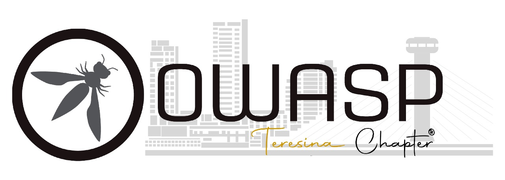

---

layout: col-sidebar
title: OWASP Teresina
tags: example-tag
region: South America
country: Brazil
meetup-group:

---

# Bem vindos, Somos o Capítulo OWASP Teresina!

Bem-vindo ao Capítulo OWASP Teresina! Nosso capítulo é parte da Open Web Application Security Project (OWASP), uma comunidade global dedicada a melhorar a segurança de software. Nosso objetivo é promover a conscientização sobre segurança de aplicativos da web, compartilhar conhecimento e promover práticas seguras de desenvolvimento de software na região de Teresina, Piauí.

Em nossos encontros regulares, reunimos profissionais de segurança, desenvolvedores, pesquisadores e estudantes para discutir tópicos relevantes de segurança da informação, incluindo ameaças cibernéticas atuais, vulnerabilidades de aplicativos da web, técnicas de ataque e melhores práticas de segurança. Nosso objetivo é criar uma comunidade vibrante e colaborativa, onde todos possam aprender e contribuir para a segurança da web.

Se você está interessado em segurança de aplicativos da web, seja bem-vindo ao OWASP Teresina! Junte-se a nós em nossos eventos e faça parte desta comunidade apaixonada por segurança cibernética.

Next Meeting/Event <!-- You should keep this section as it will populate your meetup events -->
---------------------

